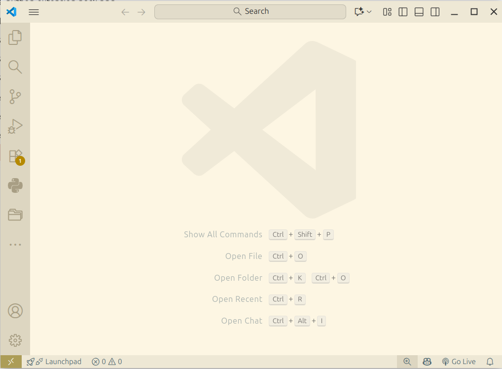
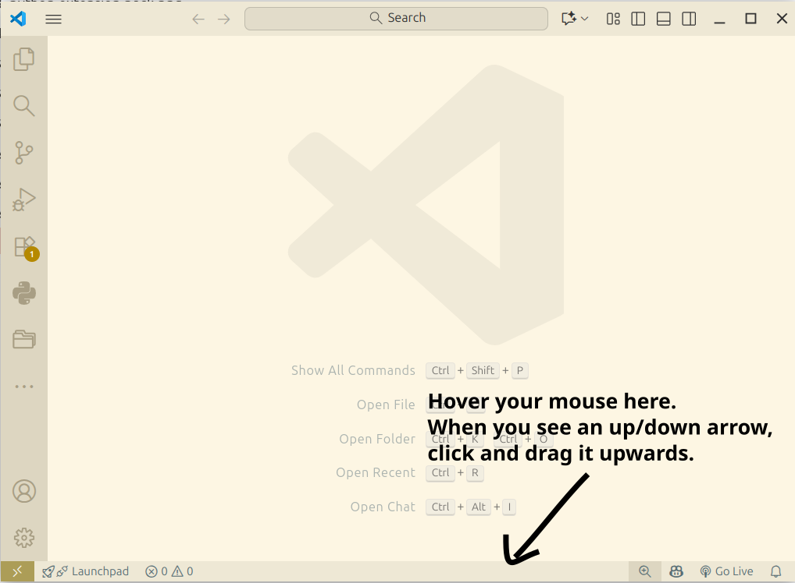
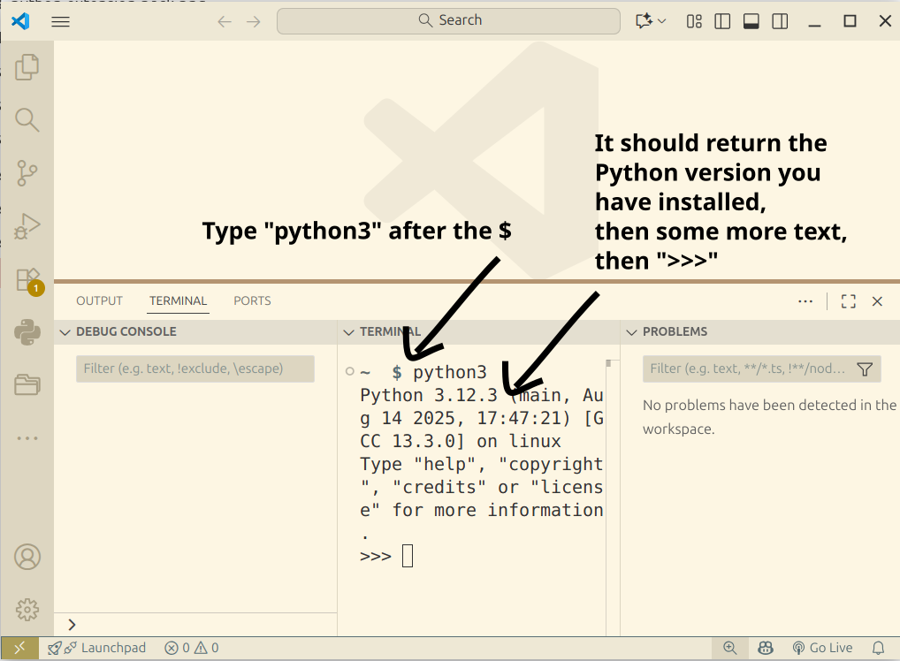
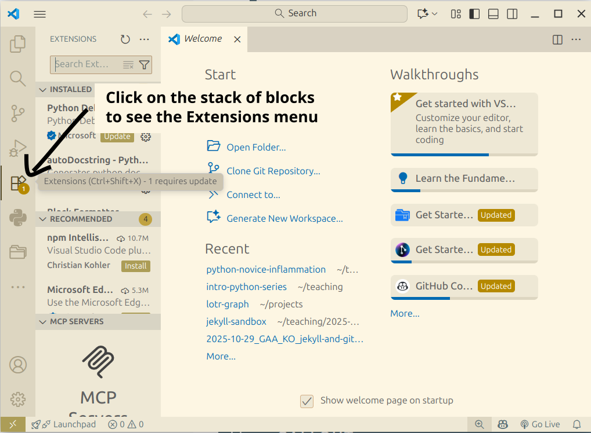
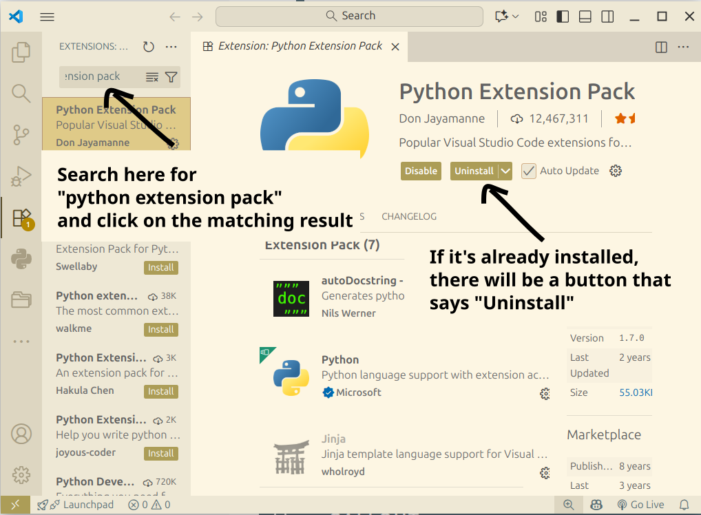
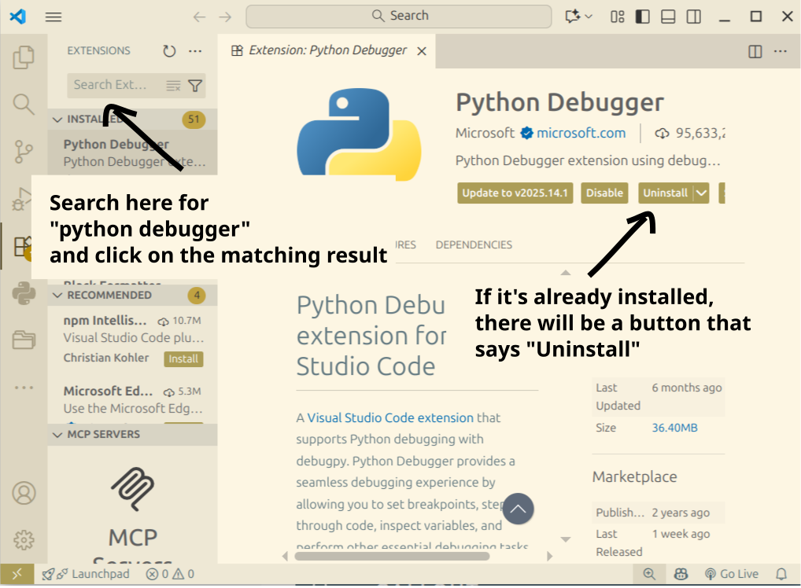

# 1.1 Setup

Let's confirm that you have these items installed:

1. Python Interpreter
2. VS Code
3. Python extension for VS Code
4. Python Debugger extension for VS Code

The links to the setup instructions are in the [Introduction page](0_introduction.md).

V
## Open VS COde

## Start the Python interpreter

## 3. Check you have the Python Extension Pack

## Check you have the Python Debugger

