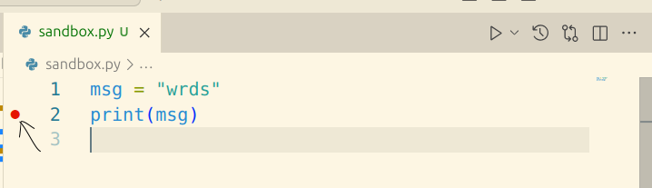
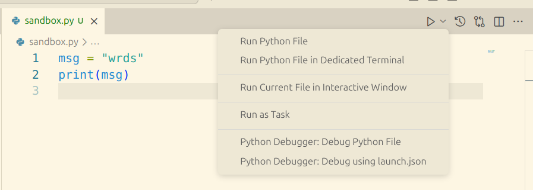
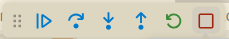

# 1.4 Scripts

Now we'll learn how to create a Python program by storing Python code in an executable file.
"Executing" or "running" the file runs all the code in it.

## Start a new .py file

Click "File --> New Text File" or hit ``Cntl+N`` to open a new blank file. 

Click "File --> Save As" or hit ``Cntl+S`` to save the file.

Give the file a name with the ".py" extension (e.g., "sandbox.py").
This extension tells VS Code that it's a Python program.

## Add some code to the file

```python
msg = "Hello World!"
print(msg)
```

And save it with ``Cntl+S``.

As you type, you might see that VS Code gives you some audo-complete options. This is ["IntelliSense"](https://code.visualstudio.com/docs/editing/intellisense).

## Run the Python file

There are a few ways to run the code in this file. 

To run the entire file, the options are

1. Click the triangle icon at the top-right of the VS Code window.
2. Right click anywhere over the file, and select **Run Python --> Run Python File in Terminal**

To run part of the file, the options are 
1. Highlight one or more lines (or put your cursor in one line), right click, and select **Run Python --> Run Python File in Terminal**
2. Highlight one or more lines (or put your cursor in one line) and hit ``Shift+Enter``


## Try the debugger

### Use the debugger to jump into the code

Set a *break point* by clicking the space to the left of a line of code.



Initialize the debugger by pressing `F5` and click **Python File**.

To run the file with the debugger, click the downward arrow beside the triangle icon, and select **Python Debugger: Debug Python File**. 




On the left side of the VS Code window, you see the list of variables, including `msg`.

At the bottom of the window, you see a section called "DEBUG CONSOLE". 
If you click to the right of the `>`, you can type Python code.
If you type `msg` and ht `Enter`, it will show you the value of the variable `msg`.

Try defining a new variable here, and see it shows up on the list of variables on the left.

To exit the debug mode, look at the little menu at the top of the screen, and click on the red square.



### Use debugger to fix mistakes

To see how the debugger helps you fix mistakes, add a mistake to your file and then run it again with the debugger. For example,

```python
msg = "Hello World!"
pring(msg)
```

Now run the file with the debugger, and see what happens. 

It basically adds a break point on the line with the error, and lets you interact with the variables that have been defined before that line. 