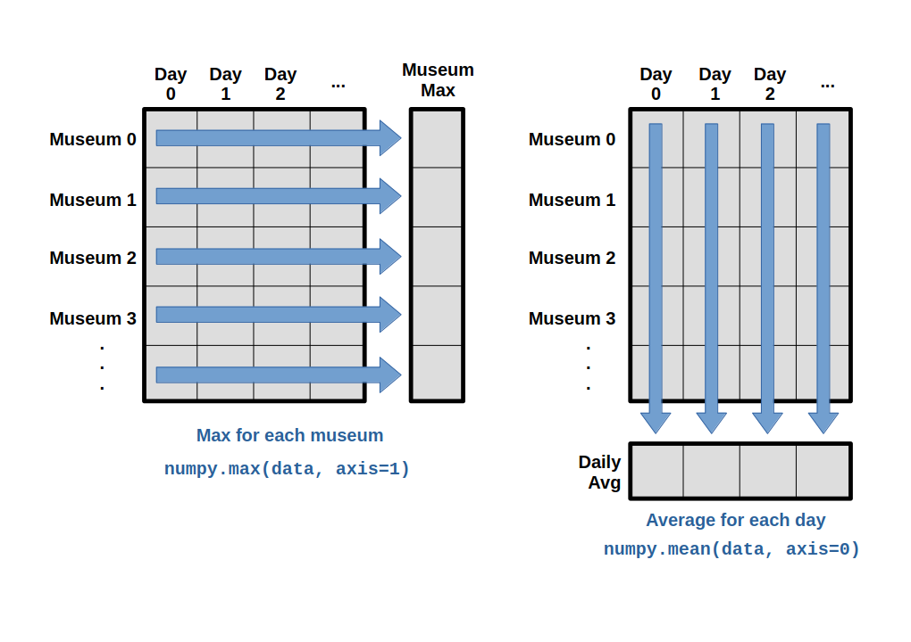

# 2.2 Reading and Manipulating Tabular Data

## Questions we'll cover

- What are libraries?
- How do I use functions from libraries?
- How do I define a path to a data file relative to my code file?
- How can I read, manipulate, and analyze tabular data files in Python?

-----------
----------------

Words are useful, but what's more useful are the sentences and stories we build with them.
Similarly, while a lot of powerful, general tools are built into Python,
specialized tools built up from these basic units live in
**libraries**
that can be called upon when needed.

## Loading data into Python

To begin processing the exhibit-visit data, we need to load it into Python.
We can do that using a library called
[NumPy](https://numpy.org/doc/stable "NumPy Documentation"), which stands for Numerical Python.
In general, you should use this library when you want to do fancy things with lots of numbers,
especially if you have matrices or arrays. To tell Python that we'd like to start using NumPy,
we need to **import** it:

```python
import numpy
```

Importing a library is like getting a piece of lab equipment out of a storage locker and setting it
up on the bench. Libraries provide additional functionality to the basic Python package, much like
a new piece of equipment adds functionality to a lab space. Just like in the lab, importing too
many libraries can sometimes complicate and slow down your programs - so we only import what we
need for each program.

Once we've imported the library, we can ask the library to read our data file for us:

```python
data = numpy.loadtxt(fname='exhibit-visits-01.csv', delimiter=',')
```

These data correspond to the number of visitors to a digital museum exhibit that was shown in museums across Canada.
The rows are the individual museums, and the columns
are the daily number of visitors to the exhibit.

The expression `numpy.loadtxt(...)` is a
**function call**
that asks Python to run the **function** `loadtxt` which
belongs to the `numpy` library.
The dot notation in Python is used most of all as an object attribute/property specifier or for invoking its method. `object.property` will give you the object.property value,
`object_name.method()` will invoke on object\_name method.

As an example, John Smith is the John that belongs to the Smith family.
We could use the dot notation to write his name `smith.john`,
just as `loadtxt` is a function that belongs to the `numpy` library.

`numpy.loadtxt` has two **parameters**: the name of the file
we want to read and the **delimiter** that separates values
on a line. These both need to be character strings
(or **strings** for short), so we put them in quotes.

This statement doesn't produce any output because we've assigned the output to the variable `data`.
If we want to check that the data have been loaded,
we can print the variable's value:

```python
print(data)
```

```output
[[ 6. 13. 11. ...  8.  4.  7.]
 [18.  4. 12. ...  2.  3.  4.]
 [19. 14. 12. ...  5.  6.  2.]
 ...
 [ 9. 10. 15. ...  6.  6.  4.]
 [ 8. 13. 18. ...  8.  6.  6.]
 [ 6. 18. 11. ...  8.  5.  5.]]
```

By default,
only a few rows and columns are shown
(with `...` to omit elements when displaying big arrays).
Note that, to save space when displaying NumPy arrays, Python does not show us trailing zeros,
so `1.0` becomes `1.`.

Now that the data are in memory,
we can manipulate them.
First,
let's ask what **type** of thing `data` refers to:

```python
print(type(data))
```

```output
<class 'numpy.ndarray'>
```

The output tells us that `data` currently refers to
an N-dimensional array, the functionality for which is provided by the NumPy library.


## Data type within the Numpy array

A Numpy array contains one or more elements
of the same type. The `type` function will only tell you that
a variable is a NumPy array but won't tell you the type of
thing inside the array.
We can find out the type
of the data contained in the NumPy array.

```python
print(data.dtype)
```

```output
float64
```

This tells us that the NumPy array's elements are
**floating-point numbers**.

With the following command, we can see the array's **shape**:

```python
print(data.shape)
```

```output
(60, 40)
```

The output tells us that the `data` array variable contains 60 rows and 40 columns. When we
created the variable `data` to store our exhibit-visit data, we did not only create the array; we also
created information about the array, called **members** or
attributes. This extra information describes `data` in the same way an adjective describes a noun.
`data.shape` is an attribute of `data` which describes the dimensions of `data`. We use the same
dotted notation for the attributes of variables that we use for the functions in libraries because
they have the same part-and-whole relationship.

If we want to get a single number from the array, we must provide an
**index** in square brackets after the variable name, just as we
do in math when referring to an element of a matrix.  Our exhibit-visit data has two dimensions, so
we will need to use two indices to refer to one specific value:

```python
print('first value in data:', data[0, 0])
```

```output
first value in data: 0.0
```

```python
print('middle value in data:', data[29, 19])
```

```output
middle value in data: 8.0
```

The expression `data[29, 19]` accesses the element at row 30, column 20. While this expression may
not surprise you,
`data[0, 0]` might.
Programming languages like Fortran, MATLAB and R start counting at 1
because that's what human beings have done for thousands of years.
Languages in the C family (including C++, Java, Perl, and Python) count from 0
because it represents an offset from the first value in the array (the second
value is offset by one index from the first value). This is closer to the way
that computers represent arrays (if you are interested in the historical
reasons behind counting indices from zero, you can read
[Mike Hoye's blog post](https://exple.tive.org/blarg/2013/10/22/citation-needed/)).
As a result,
if we have an M×N array in Python,
its indices go from 0 to M-1 on the first axis
and 0 to N-1 on the second.
It takes a bit of getting used to,
but one way to remember the rule is that
the index is how many steps we have to take from the start to get the item we want.

!["'data' is a 3 by 3 numpy array containing row 0: \['A', 'B', 'C'\], row 1: \['D', 'E', 'F'\], androw 2: \['G', 'H', 'I'\]. Starting in the upper left hand corner, data\[0, 0\] = 'A', data\[0, 1\] = 'B',data\[0, 2\] = 'C', data\[1, 0\] = 'D', data\[1, 1\] = 'E', data\[1, 2\] = 'F', data\[2, 0\] = 'G',data\[2, 1\] = 'H', and data\[2, 2\] = 'I', in the bottom right hand corner."](fig/2.2_python-zero-index.svg)


## In the Corner

What may also surprise you is that when Python displays an array,
it shows the element with index `[0, 0]` in the upper left corner
rather than the lower left.
This is consistent with the way mathematicians draw matrices
but different from the Cartesian coordinates.
The indices are (row, column) instead of (column, row) for the same reason,
which can be confusing when plotting data.

## Slicing data

An index like `[30, 20]` selects a single element of an array,
but we can select whole sections as well.
For example,
we can select the first ten days (columns) of values
for the first four museums (rows) like this:

```python
print(data[0:4, 0:10])
```

```output
[[ 6. 13. 11. 11.  7.  7.  4.  6.  8.  8.]
 [18.  4. 12.  5. 12.  7. 11.  5. 11.  3.]
 [19. 14. 12. 17.  7. 12. 11.  7.  4.  2.]
 [17.  4.  4.  7.  6. 15.  6.  4.  9. 11.]]
```

The **slice** `0:4` means, "Start at index 0 and go up to,
but not including, index 4". Again, the up-to-but-not-including takes a bit of getting used to,
but the rule is that the difference between the upper and lower bounds is the number of values in
the slice.

We don't have to start slices at 0:

```python
print(data[5:10, 0:10])
```

```output
[[12.  5. 18.  9.  5.  3. 10.  3. 12.  7.]
 [ 9. 17. 15.  8.  9.  3. 13.  7.  8.  2.]
 [20.  8.  5. 13. 15. 10.  6. 10.  6.  7.]
 [ 6. 16. 12.  6.  8. 14.  6. 13. 10. 11.]
 [18. 15. 16. 14. 12.  7.  3.  8.  9. 11.]]
```

We also don't have to include the upper and lower bound on the slice.  If we don't include the lower
bound, Python uses 0 by default; if we don't include the upper, the slice runs to the end of the
axis, and if we don't include either (i.e., if we use ':' on its own), the slice includes
everything:

```python
small = data[:3, 36:]
print('small is:')
print(small)
```

The above example selects rows 0 through 2 and columns 36 through to the end of the array.

```output
small is:
[[5. 8. 4. 7.]
 [5. 2. 3. 4.]
 [5. 5. 6. 2.]]
```

## Analyzing data

NumPy has several useful functions that take an array as input to perform operations on its values.
If we want to find the average visits for all museums on
all days, for example, we can ask NumPy to compute `data`'s mean value:

```python
print(numpy.mean(data))
```

```output
7.437916666666666
```

`mean` is a **function** that takes
an array as an **argument**.


## Sidenote: Not All Functions Have Input

Generally, a function uses inputs to produce outputs.
However, some functions produce outputs without
needing any input. For example, checking the current time
doesn't require any input.

```python
import time
print(time.ctime())
```

```output
Tue Nov 18 21:06:59 2025
```

For functions that don't take in any arguments,
we still need parentheses (`()`)
to tell Python to go and do something for us.

---------------

Let's use three other NumPy functions to get some descriptive values about the dataset.
We'll also use multiple assignment,
a convenient Python feature that will enable us to do this all in one line.

```python
maxval, minval, stdval = numpy.amax(data), numpy.amin(data), numpy.std(data)

print('maximum visits:', maxval)
print('minimum visits:', minval)
print('standard deviation:', stdval)
```

Here we've assigned the return value from `numpy.amax(data)` to the variable `maxval`, the value
from `numpy.amin(data)` to `minval`, and so on.

```output
maximum visits: 20.0
minimum visits: 0.0
standard deviation: 4.315222550427987
```

## Sidenote: Mystery Functions in IPython

How did we know what functions NumPy has and how to use them?
If you are working in IPython, a Jupyter Notebook, and some text editors, there is an easy way to find out.
If you type the name of something followed by a dot, then you can use
**tab-completion**
(e.g. type `numpy.` and then press <kbd>Tab</kbd>)
to see a list of all functions and attributes that you can use.

## Sidenote: Confusing Function Names

One might wonder why the functions are called `amax` and `amin` and not `max` and `min` or why the other is called `mean` and not `amean`.
The package `numpy` does provide functions `max` and `min` that are fully equivalent to `amax` and `amin`, but they share a name with standard library functions `max` and `min` that come with Python itself.
Referring to the functions like we did above, that is `numpy.max` for example, does not cause problems, but there are other ways to refer to them that could.
In addition, text editors might highlight (color) these functions like standard library function, even though they belong to NumPy, which can be confusing and lead to errors.
Since there is no function called `mean` in the standard library, there is no function called `amean`.

--------------

When analyzing data, though,
we often want to look at variations in statistical values,
such as the maximum visits per museum
or the average visits per day.
One way to do this is to create a new temporary array of the data we want,
then ask it to do the calculation:

```python
museum_0 = data[0, :] # 0 on the first axis (rows), everything on the second (columns)
print('maximum visits for museum 0:', numpy.amax(museum_0))
```

```output
maximum visits for museum 0: 18.0
```

We don't actually need to store the row in a variable of its own.
Instead, we can combine the selection and the function call:

```python
print("maximum visits for museum 2:", numpy.amax(data[2, :]))
```

```output
maximum visits for museum 2: 19.0
```

What if we need the maximum visits for each museum over all days (as in the
next diagram on the left) or the average for each day (as in the
diagram on the right)? As the diagram below shows, we want to perform the
operation across an axis:



To find the **maximum number of visits reported for each museum**, you would apply the `max` function moving across the columns (axis 1). To find the **daily average number of visits reported across museums**, you would apply the `mean` function moving down the rows (axis 0). 

To support this functionality, most array functions allow us to specify the axis we want to work on. If we ask for the max across axis 1 (columns in our 2D example), we get:

```python
print(numpy.max(data, axis=1))
```

```output
[18. 18. 19. 18. 17. 18. 17. 20. 17. 18. 18. 18. 17. 16. 14. 18. 19. 19.
 15. 19. 19. 18. 17. 16. 17. 17. 18. 17. 20. 17. 16. 19. 15. 18. 19. 17.
 16. 17. 19. 16. 18. 19. 16. 19. 18. 16. 19. 15. 16. 18. 14. 20. 19. 15.
 19. 19. 17. 19. 18. 18.]
```

As a quick check, we can ask this array what its shape is. We expect 60 museum maximums:

```python
print(numpy.max(data, axis=1).shape)
```

```output
(60,)
```

The expression `(60,)` tells us we have an N×1 vector, so this is the maximum visits per day for each museum. 

If we ask for the average across/down axis 0 (rows in our 2D example), we get:

```python
print(numpy.mean(data, axis=0))
```

```output
[13.25       11.96666667 11.03333333 10.16666667 10.          8.66666667
  9.15        7.25        7.33333333  6.58333333  6.06666667  5.95
  5.11666667  3.6         3.3         3.56666667  2.48333333  1.5
  3.8         5.23333333  5.95        8.36666667 11.56666667 12.35
 11.96666667 11.03333333 10.16666667 10.          8.66666667  9.58333333
  9.15        8.35        7.25        6.58333333  6.06666667  5.95
  5.86666667  5.23333333  3.8         3.6       ]
```

Check the array shape. We expect 40 averages, one for each day of the study:

```python
print(numpy.mean(data, axis=0).shape)
```

```output
(40,)
```
Similarly, we can apply the `mean` function to axis 1 to get the museum's average visits over the duration of the exhibit (60 values). 

```python
print(numpy.mean(data, axis=1))
```
```output
[7.275 6.65  7.05  6.875 6.95  6.825 7.    7.925 8.075 8.475 8.075 6.975
 7.15  7.225 6.525 8.075 8.25  7.3   6.75  8.175 6.85  7.425 7.    7.3
 7.1   6.95  6.925 7.3   7.45  8.45  7.275 7.825 8.    7.975 8.325 6.975
 6.9   8.4   6.225 6.725 7.225 7.275 7.45  6.9   7.95  7.75  8.25  7.25
 6.925 7.3   7.325 7.4   8.475 6.7   8.45  6.85  7.65  8.05  8.725 7.4  ]
```


## Challenge: Slicing Strings

A section of an array is called a **slice**.
We can take slices of character strings as well:

```python
element = 'oxygen'
print('first three characters:', element[0:3])
print('last three characters:', element[3:6])
```

```output
first three characters: oxy
last three characters: gen
```
### Ask yourself: What is the value of `element[:4]`? What about `element[4:]`? Or `element[:]`?


### Solution

```output
oxyg
en
oxygen
```

### Ask yourself: What is `element[-1]`? What is `element[-2]`?

### Solution

```output
n
e
```

### Ask yourself: Given those answers, explain what `element[1:-1]` does

### Solution

Creates a substring from index 1 up to (not including) the final index,
effectively removing the first and last letters from 'oxygen'

### Ask yourself: How can we rewrite the slice for getting the last three characters of `element`,so that it works even if we assign a different string to `element`?

Test your solution with the following strings: `carpentry`, `clone`, `hi`.


### Solution

```python
element = 'oxygen'
print('last three characters:', element[-3:])
element = 'carpentry'
print('last three characters:', element[-3:])
element = 'clone'
print('last three characters:', element[-3:])
element = 'hi'
print('last three characters:', element[-3:])
```

```output
last three characters: gen
last three characters: try
last three characters: one
last three characters: hi
```

---------------------------------

## Challenge: Thin Slices

The expression `element[3:3]` produces an
**empty string**,
i.e., a string that contains no characters.
If `data` holds our array of ehibit-visit data,
what does `data[3:3, 4:4]` produce?
What about `data[3:3, :]`?

### Solution

```output
array([], shape=(0, 0), dtype=float64)
array([], shape=(0, 40), dtype=float64)
```

---------------------

## Challenge: Stacking Arrays

Arrays can be concatenated and stacked on top of one another,
using NumPy's `vstack` and `hstack` functions for vertical and horizontal stacking, respectively.

```python
import numpy

A = numpy.array([[1, 2, 3], [4, 5, 6], [7, 8, 9]])
print('A = ')
print(A)

B = numpy.hstack([A, A])
print('B = ')
print(B)

C = numpy.vstack([A, A])
print('C = ')
print(C)
```

```output
A =
[[1 2 3]
 [4 5 6]
 [7 8 9]]
B =
[[1 2 3 1 2 3]
 [4 5 6 4 5 6]
 [7 8 9 7 8 9]]
C =
[[1 2 3]
 [4 5 6]
 [7 8 9]
 [1 2 3]
 [4 5 6]
 [7 8 9]]
```

Write some additional code that slices the first and last columns of `A`,
and stacks them into a 3x2 array.
Make sure to `print` the results to verify your solution.

### Solution

A 'gotcha' with array indexing is that singleton dimensions
are dropped by default. That means `A[:, 0]` is a one dimensional
array, which won't stack as desired. To preserve singleton dimensions,
the index itself can be a slice or array. For example, `A[:, :1]` returns
a two dimensional array with one singleton dimension (i.e. a column
vector).

```python
D = numpy.hstack((A[:, :1], A[:, -1:]))
print('D = ')
print(D)
```

```output
D =
[[1 3]
 [4 6]
 [7 9]]
```

### Solution

An alternative way to achieve the same result is to use Numpy's
delete function to remove the second column of A. If you're not
sure what the parameters of numpy.delete mean, use the help files.

```python
D = numpy.delete(arr=A, obj=1, axis=1)
print('D = ')
print(D)
```

```output
D =
[[1 3]
 [4 6]
 [7 9]]
```

--------------

## Challenge: Change In Number of Visits

The exhibit-visit data is *longitudinal* in the sense that each row represents a
series of observations relating to one museum.  This means that
the change in visits over time is a meaningful concept.
Let's find out how to calculate changes in the data contained in an array
with NumPy.

The `numpy.diff()` function takes an array and returns the differences
between two successive values. Let's use it to examine the changes
each day across the first week of museum 3 from our exhibit-visit dataset.

```python
museum3_week1 = data[3, :7]
print(museum3_week1)
```

```output
[17.  4.  4.  7.  6. 15.  6.]
```

Calling `print(numpy.diff(museum3_week1))` would do the following calculations

```python
[4 - 17, 4 - 4, 7 - 4, 6 - 7, 15 - 6, 6 - 15]
```

and return the 6 difference values in a new array.

```python
print(numpy.diff(museum3_week1))
```

```output
[-13.   0.   3.  -1.   9.  -9.]
```

Note that the array of differences is shorter by one element (length 6).

When calling `numpy.diff` with a multi-dimensional array, an `axis` argument may
be passed to the function to specify which axis to process. 

### Ask yourself: When applying `numpy.diff` to our 2D exhibit-visit array `data`, which axis would we specify?

Since the row axis (0) is museums, it does not make sense to get the
difference between two arbitrary museums. The column axis (1) is in
days, so the difference is the change in number of visits -- a meaningful
concept.

```python
print(numpy.diff(data, axis=1))
```

```output
[[  7.  -2.   0. ...   3.  -4.   3.]
 [-14.   8.  -7. ...  -3.   1.   1.]
 [ -5.  -2.   5. ...   0.   1.  -4.]
 ...
 [  1.   5.  -5. ...   0.   0.  -2.]
 [  5.   5.  -1. ...   0.  -2.   0.]
 [ 12.  -7.  -2. ...   3.  -3.   0.]]
```


### Ask yourself: If the shape of an individual data file is `(60, 40)` (60 rows and 40 columns), what would the shape of the array be after you run the `diff()` function and why?

The shape will be `(60, 39)` because there is one fewer difference between
columns than there are columns in the data.

### Ask yourself: How would you find the largest change in exhibit visits for each museum? Does it matter if the change in exhibit visits is an increase or a decrease?

By using the `numpy.amax()` function after you apply the `numpy.diff()`
function, you will get the largest difference between days.

```python
print(numpy.amax(numpy.diff(data, axis=1), axis=1))
```

```output
[ 7.  8. 10. 11. 11. 13. 10. 10. 11. 10.  8.  8.  7.  8. 10. 13.  8. 11.
  9. 10.  8.  8.  9.  9.  8.  9.  8. 10.  7. 14. 12. 10.  7. 11. 12.  8.
 10. 12.  9. 12. 13.  7. 10. 13. 12. 12. 11.  9.  9. 13.  8. 13.  9.  7.
  7.  8. 10.  8.  8. 12.]
```

If exhibit-visit values *decrease* along an axis, then the difference from
one element to the next will be negative. If
you are interested in the **magnitude** of the change and not the
direction, the `numpy.absolute()` function will provide that.

Notice the difference if you get the largest *absolute* difference
between readings.

```python
print(numpy.amax(numpy.absolute(numpy.diff(data, axis=1)), axis=1))
```

```output
[ 7. 14. 13. 13. 13. 13. 10. 12. 11. 10. 13. 12. 10. 10. 10. 13. 12. 13.
  9. 13. 10.  9.  9.  9. 11. 13.  9. 13. 13. 14. 12. 13.  7. 11. 12. 13.
 10. 12. 10. 12. 13. 13. 11. 13. 13. 12. 12.  9.  9. 13.  8. 13. 13.  9.
  8. 11. 13.  8.  9. 12.]
```

--------

## Key Points

- Import a library into a program using `import libraryname`.
- Use the `numpy` library to work with arrays in Python.
- The expression `array.shape` gives the shape of an array.
- Use `array[x, y]` to select a single element from a 2D array.
- Array indices start at 0, not 1.
- Use `low:high` to specify a `slice` that includes the indices from `low` to `high-1`.
- Use `# some kind of explanation` to add comments to programs.
- Use `numpy.mean(array)`, `numpy.amax(array)`, and `numpy.amin(array)` to calculate simple statistics.
- Use `numpy.mean(array, axis=0)` or `numpy.mean(array, axis=1)` to calculate statistics across the specified axis.
