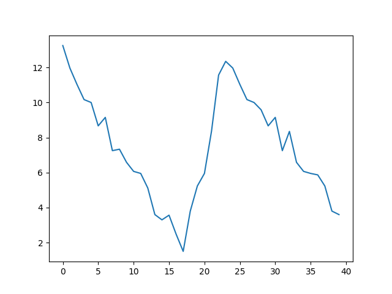

# 2.3 Visualizing Tabular Data

## Questions we'll cover

- How can I visualize tabular data in Python?
- How can I group several plots together?
- How can I customize plots to make them more understandable?

---------------
-----------------

## Visualizing data

The mathematician Richard Hamming once said, "The purpose of computing is insight, not numbers,"
and the best way to develop insight is often to visualize data.  Visualization deserves an entire
lecture of its own, but we can explore a few features of Python's `matplotlib` library here.  While
there is no official plotting library, `matplotlib` is the *de facto* standard.  First, we will
import the `pyplot` module from `matplotlib` and use two of its functions to create and display a
**heat map** of our data:

---------------------------

```python
import numpy
import matplotlib.pyplot

data = numpy.loadtxt(fname='exhibit-visits-01.csv', delimiter=',')
fig1, ax1 = matplotlib.pyplot.subplots()
ax1.imshow(data)
fig1.savefig("1_imshow.png")
```


Each row in the heat map corresponds to a museum in the exhibit-visit dataset, and each column
corresponds to a day in the dataset.  Blue pixels in this heat map represent low values, while
yellow pixels represent high values.  As we can see, the general number of exhibit visits
for the museums rises and falls over a 40-day period.


The line `fig1, ax1 = matplotlib.pyplot.subplots()` initiates a figure object (`fig1`) and an axis object (`ax1`) within the figure.
Note that, despite the plural `subplots` in the command, you can use it to create one OR more subplots. 
Here, we're just creating one.

The line `ax1.imshow(data)` takes the data and creates a heatmap in the axis.

The line `fig1.savefig("1_imshow.png")` stores the entire figure as a graphics file. This can be
a convenient way to store your plots for use in other documents, web
pages etc. The graphics format is automatically determined by
Matplotlib from the file name ending we specify; here PNG from
'1_imshow.png'. Matplotlib supports many different graphics
formats, including SVG, PDF, and JPEG.

Now let's take a look at the average exhibit visits over time:

```python
ave_visits = numpy.mean(data, axis=0)
fig2, ax2 = matplotlib.pyplot.subplots()
ax2.plot(ave_visits)
fig2.savefig("2_lineplot.png")
```



Here, we have put the average exhibit visits per day across all museums in the variable
`ave_visits`, then asked `matplotlib.pyplot` to create and display a line graph of those
values.  The result is a reasonably clear fall, rise, and fall again, in line with Maverick's claim that
the advertising campaign brought the visit numbers back up.  

### Grouping plots

You can group similar plots in a single figure using subplots.
<!-- This script below uses a number of new commands. The function `matplotlib.pyplot.figure()`
creates a space into which we will place all of our plots. The parameter `figsize`
tells Python how big to make this space. Each subplot is placed into the figure using
its `add_subplot` **method**. The `add_subplot` method takes
3 parameters. The first denotes how many total rows of subplots there are, the second parameter
refers to the total number of subplot columns, and the final parameter denotes which subplot
your variable is referencing (left-to-right, top-to-bottom). Each subplot is stored in a
different variable (`axes1`, `axes2`, `axes3`).  -->

Once a subplot is created, the axes can
be titled using the `set_xlabel()` command (or `set_ylabel()`).
Here are our three plots side by side:

```python
fig3, axs3 = matplotlib.pyplot.subplots(1, 3, figsize=(10,3))

axs3[0].set_ylabel("average")
axs3[0].plot(numpy.mean(data, axis=0))

axs3[1].set_ylabel("max")
axs3[1].plot(numpy.amax(data, axis=0))

axs3[2].set_ylabel("min")
axs3[2].plot(numpy.amin(data, axis=0))

fig3.tight_layout()

fig3.savefig("3_subplots.png")
```


The line `fig3, axs3 = matplotlib.pyplot.subplots(1, 3, figsize=(10, 4))` creates a figure object (`fig3`) with an axes object (`axs3`).
I say *axes* (plural) because it is an array with 3 sets of axes in it; the first two parameters, `1` and `3` indicated that we wanted one row and three columns of subplots. 

We add more to each set of axes by refering to its place in the array of axes-sets (e.g., `axs[0]`).
The line `axs3[0].set_ylabel("average")` adds a label to the y-axis of the first subplot.
The line `axs3[0].plot(numpy.mean(data, axis=0))` adds a line graph inside the first subplot.`

After adding everything we want to the plot, we run `fig3.tight_layout()` to space out the graphs so that their y-axis labels don't overlap.


## Side note: Importing libraries with shortcuts

In this lesson we use the `import matplotlib.pyplot`
**syntax**
to import the `pyplot` module of `matplotlib`. However, shortcuts such as
`import matplotlib.pyplot as plt` are frequently used.
Importing `pyplot` this way means that after the initial import, rather than writing
`matplotlib.pyplot.plot(...)`, you can now write `plt.plot(...)`.
Another common convention is to use the shortcut `import numpy as np` when importing the
NumPy library. We then can write `np.loadtxt(...)` instead of `numpy.loadtxt(...)`,
for example.

Some people prefer these shortcuts as it is quicker to type and results in shorter
lines of code - especially for libraries with long names! You will frequently see
Python code online using a `pyplot` function with `plt`, or a NumPy function with
`np`, and it's because they've used this shortcut. It makes no difference which
approach you choose to take, but you must be consistent as if you use
`import matplotlib.pyplot as plt` then `matplotlib.pyplot.plot(...)` will not work, and
you must use `plt.plot(...)` instead. Because of this, when working with other people it
is important you agree on how libraries are imported.

## Challenge: Plot Scaling

Why do all of our plots stop just short of the upper end of our graph?

### Solution

Because matplotlib normally sets x and y axes limits to the min and max of our data
(depending on data range)


If we want to change this, we can use the `set_ylim(min, max)` method of each 'axes',
for example:

```python
axs3[2].set_ylim(0, 21)
```

Update your plotting code to automatically set a more appropriate scale.
(Hint: you can make use of the `max` and `min` methods to help.)

### Solution

```python
# One method
axs3[2].set_ylabel("min")
axs3[2].plot(numpy.amin(data, axis=0))
axs3[2].set_ylim(0, 21)
```


```python
# A more automated approach 
max_data = numpy.amax(data, axis=0)
y_max = numpy.amax(max_data) * 1.1

axs3[2].set_ylabel("min")
axs3[2].plot(numpy.amin(data, axis=0))
axs3[2].set_ylim(0, y_max)
```

## Challenge: Make Your Own Plot

Create a plot showing the standard deviation (`numpy.std`)
of the exhibit-visit data for each day across all museums.

### Solution

```python
fig4, ax4 = matplotlib.pyplot.subplots()
ax4.plot(numpy.std(data, axis=0))
fig4.savefig("content/fig/4_std-lineplot.png")
```

## Challenge: Moving Plots Around

Modify the program to display the three plots on top of one another
instead of side by side.

### Solution

```python
fig5, axs5 = matplotlib.pyplot.subplots(3, 1, figsize=(4,10))

axs5[0].set_ylabel("average")
axs5[0].plot(numpy.mean(data, axis=0))

axs5[1].set_ylabel("max")
axs5[1].plot(numpy.amax(data, axis=0))

axs5[2].set_ylabel("min")
axs5[2].plot(numpy.amin(data, axis=0))

fig5.tight_layout()
fig5.savefig("content/fig/2.3_5_vertical-subplots.png")
```

## Key points

- Use the `pyplot` module from the `matplotlib` library for creating simple visualizations.