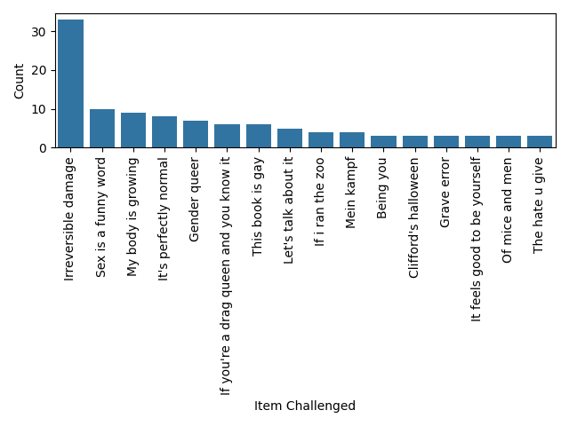
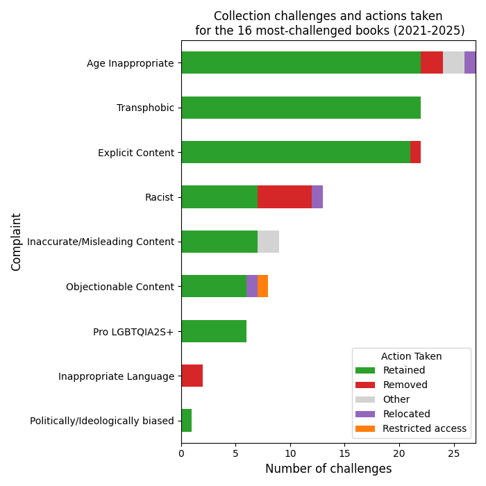

# 2.5 Making more sophisticated visualizations

## Questions we'll cover

- How do I use pandas to plot?
- How do I use seaborn to plot pandas dataframes?
- How can I visualize more data on one graph?
- How can I customize visualizations?

---------------
-----------------


```python
import pandas as pd
import matplotlib.pyplot as plt
import seaborn as sns


data = pd.read_csv("2026-01_canadian-library-challenges-database_SUBSET.csv")

# getting the data ready
item_counts_sr = data["Item Challenged"].value_counts()
item_counts_df = item_counts_sr.to_frame(name="Count").reset_index()
```

### Plotting with pandas

```python
fig1, ax1 = plt.subplots()
item_counts_df.plot.bar(x="Item Challenged", y="Count", ax=ax1)
fig1.tight_layout()
fig1.savefig("2.5_1_barplot_item-counts_pandas.png")
```


### Plotting with seaborn

```python
fig2, ax2 = plt.subplots()
sns.barplot(data=item_counts_df, y="Count", x="Item Challenged", ax=ax2)
plt.xticks(rotation=90)
fig2.tight_layout()
fig2.savefig("2.5_2_barplot_item-counts_seaborn.png")
```




### Advanced example

```python
original_df = pd.read_csv("2026-01_canadian-library-challenges-database_SUBSET.csv")
categories_df = pd.read_csv("2.5_complaint-categories.csv", index_col="Complaint")

categories = categories_df.to_dict()["Category"]

df = pd.DataFrame(columns=["Year", "Complaint", "Category", "Action Taken"])

df["Year"] = original_df["Year"]
df["Year"] = df["Year"].astype("int")

df["Action Taken"] = original_df["Action Taken"]
df["Action Taken"] = df["Action Taken"].str.lower().str.capitalize()
df = df[df["Action Taken"] != " "]
df["Action Taken"] = df["Action Taken"].str.replace(
    "Access restricted", "Restricted access"
)

df["Complaint"] = original_df["Reason A for complaint"]
df = df.loc[
    (df["Complaint"] != "\xa0")
    & (df["Complaint"] != " ")
    & (df["Complaint"] != "Other")
]

for ind, row in df.iterrows():
    df.loc[ind, "Category"] = categories[row["Complaint"]]

counts_categories = df.value_counts(subset="Category", ascending=True)
counts_actions = df.value_counts(subset="Action Taken", ascending=False)

ctab = pd.crosstab(df["Category"], df["Action Taken"])

ctab = ctab.reindex(counts_categories.index)
ctab = ctab[counts_actions.index]

colors = {
    "Retained": "tab:green",
    "Removed": "tab:red",
    "Restricted access": "tab:orange",
    "Relocated": "tab:purple",
    "Other": "lightgrey",
}
bigfont = 12

fig3, ax3 = plt.subplots(figsize=(7, 5))
ctab.plot(kind="barh", stacked=True, ax=ax3, color=colors)
ax3.set_xlabel("Number of challenges", fontsize=bigfont)
ax3.set_ylabel("Complaint", fontsize=bigfont)
ax3.set_title(
    "Collection challenges and actions taken"
    + "\n for the 16 most-challenged books "
    + f"({int(df["Year"].min())}-{int(df["Year"].max())})",
    fontsize=bigfont,
)
ax3.legend(loc="lower right", title="Action Taken")

plt.tight_layout()
fig3.savefig("2.5_3_stacked-barchart_collection-challenges.png")
```

