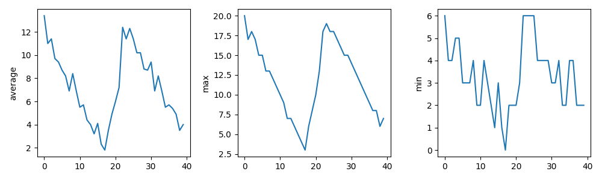
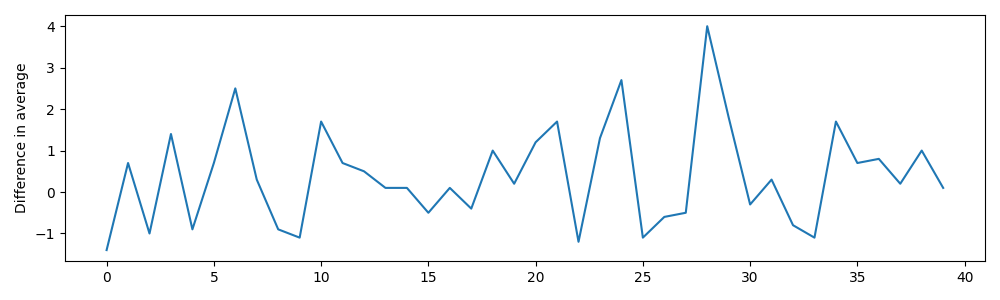
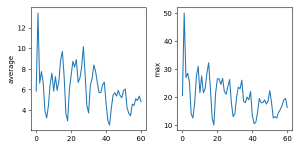

# 3.2 Repeating Actions Over Multiple Files

## Objectives

- Use a library function to get a list of filenames that match a wildcard pattern.
- Write a `for` loop to process multiple files.


## Questions

- How can I do the same operations on many different files?

-------------

As a final piece to processing our museum-visit data, we need a way to get a list of all the files from different cities
in our directory whose names start with `exhibit-visits_city-` and end with `.csv`.
The following library will help us to achieve this:

```python
import glob
```

The `glob` library contains a function, also called `glob`,
that finds files and directories whose names match a pattern.
We provide those patterns as strings:
the character `*` matches zero or more characters,
while `?` matches any one character.
We can use this to get the names of all the CSV files in the current directory:

```python
print(glob.glob('exhibit-visits_city-*.csv'))
```

```output
['exhibit-visits_city-5.csv', 'exhibit-visits_city-6.csv', 'exhibit-visits_city-4.csv', 'exhibit-visits_city-2.csv', 'exhibit-visits_city-3.csv', 'exhibit-visits_city-1.csv']
```

As these examples show,
`glob.glob`'s result is a list of file and directory paths in arbitrary order.
This means we can loop over it
to do something with each filename in turn.
In our case,
the "something" we want to do is generate a set of plots for each file in our inflammation dataset.

If we want to start by analyzing just the first three files in alphabetical order, we can use the
`sorted` built-in function to generate a new sorted list from the `glob.glob` output:

```python
import glob

import numpy
import matplotlib.pyplot

filenames = sorted(glob.glob("exhibit-visits_city-*.csv"))
filenames = filenames[0:3]
for filename in filenames:
    print(filename)

    data = numpy.loadtxt(fname=filename, delimiter=",")

    fig, axs = matplotlib.pyplot.subplots(1, 3, figsize=(10, 3))

    axs[0].set_ylabel("average")
    axs[0].plot(numpy.mean(data, axis=0))

    axs[1].set_ylabel("max")
    axs[1].plot(numpy.amax(data, axis=0))

    axs[2].set_ylabel("min")
    axs[2].plot(numpy.amin(data, axis=0))

    fig.tight_layout()
    figure_filename = f"content/fig/3.2_plot_{filename[:-4]}.png"
    fig.savefig(figure_filename)
```

```output
exhibit-visits_city-1.csv
exhibit-visits_city-2.csv
exhibit-visits_city-3.csv
```




## Challenge: Plotting Differences

We also have data for city 1 over three years in these files:
- `exhibit-visits_year-1_city-1.csv`
- `exhibit-visits_year-2_city-1.csv`
- `exhibit-visits_year-3_city-1.csv`

Plot the difference between the average museum visits reported in the first and second years.

### Solution

```python
import glob
import numpy
import matplotlib.pyplot

filenames = sorted(glob.glob("exhibit-visits_year-*_city-1.csv"))

data0 = numpy.loadtxt(fname=filenames[0], delimiter=",")
data1 = numpy.loadtxt(fname=filenames[1], delimiter=",")
diff_bw_averages = numpy.mean(data0, axis=0) - numpy.mean(data1, axis=0)

fig, ax = matplotlib.pyplot.subplots(figsize=(10, 3))

matplotlib.pyplot.ylabel("Difference in average")
matplotlib.pyplot.plot(diff_bw_averages)

fig.tight_layout()
fig.savefig("3.2_plot_diff-bw-averages.png")
```



## Challenge: Generate Composite Statistics

Use the three yearly files for city 1 to generate a dataset containing values averaged over all three years by completing the code inside the loop given below:

```python
# 1) write code here to list those three files using glob.glob()
composite_data = numpy.zeros((10, 40))
for filename in filenames:
    print(filename)
    # 2) write code here to sum each new file's data into composite_data as it's read

# 3) write code here to divide the composite_data by number of samples to get the average across files (years)

# 4) write code here to use pyplot to generate and plot the average, max, and min for all patients in three subplots.

```


### Solution

```python
import glob
import numpy
import matplotlib.pyplot

filenames = glob.glob("exhibit-visits_year-*_city-1.csv")
composite_data = numpy.zeros((10, 40))

for filename in filenames:
    print(filename)
    data = numpy.loadtxt(fname=filename, delimiter=",")
    composite_data = composite_data + data

composite_data = composite_data / len(filenames)

fig, axs = matplotlib.pyplot.subplots(1, 3, figsize=(10, 3))

axs[0].set_ylabel("average")
axs[0].plot(numpy.mean(composite_data, axis=0))

axs[1].set_ylabel("max")
axs[1].plot(numpy.amax(composite_data, axis=0))

axs[2].set_ylabel("min")
axs[2].plot(numpy.amin(composite_data, axis=0))

fig.tight_layout()

fig.savefig("3.2_plot_composite.png")
```

```output
exhibit-visits_year-1_city-1.csv
exhibit-visits_year-2_city-1.csv
exhibit-visits_year-3_city-1.csv
```



-----------------

## Key points

- Use `glob.glob(pattern)` to create a list of files whose names match a pattern.
- Use `*` in a pattern to match zero or more characters, and `?` to match any single character.
