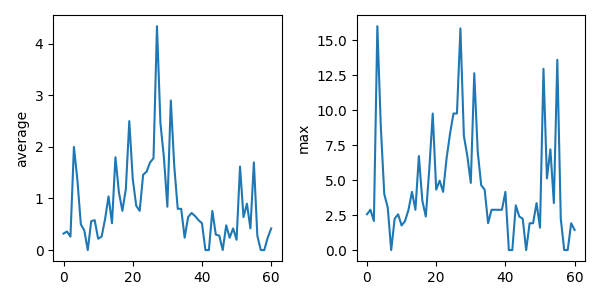
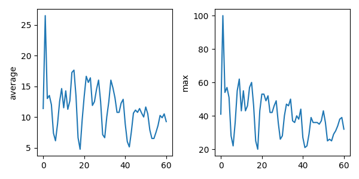

# 3.2 Repeating Actions Over Multiple Files

## Objectives

- Use a library function to get a list of filenames that match a wildcard pattern.
- Write a `for` loop to process multiple files.


## Questions

- How can I do the same operations on different files?

-------------

As a final piece to processing our book-search data, we need a way to get a list of all the files from different cities
in our directory whose names start with `exhibit-visits_city-` and end with `.csv`.
The following library will help us to achieve this:

```python
import glob
```

The `glob` library contains a function, also called `glob`,
that finds files and directories whose names match a pattern.
We provide those patterns as strings:
the character `*` matches zero or more characters,
while `?` matches any one character.
We can use this to get the names of all the CSV files in the current directory:

```python
print(glob.glob("2026-02-18_google-trends-search-*VALUES.csv"))
```

```output
['2026-02-18_google-trends-search-2_VALUES.csv', '2026-02-18_google-trends-search-1_VALUES.csv']
```

As these examples show,
`glob.glob`'s result is a list of file and directory paths in arbitrary order.
This means we can loop over it
to do something with each filename in turn.
In our case,
the "something" we want to do is generate a set of plots for each file in our dataset.

If we want to go through the files in alphabetical order, we can use the
`sorted` built-in function to generate a new sorted list from the `glob.glob` output:

```python
import glob

import numpy
import matplotlib.pyplot

filenames = sorted(glob.glob("2026-02-18_google-trends-search-*VALUES.csv"))
for filename in filenames:
    print(filename)

    data = numpy.loadtxt(fname=filename, delimiter=",")

    fig, axs = matplotlib.pyplot.subplots(1, 2, figsize=(6, 3))

    axs[0].set_ylabel("average")
    axs[0].plot(numpy.mean(data, axis=0))

    axs[1].set_ylabel("max")
    axs[1].plot(numpy.amax(data, axis=0))

    fig.tight_layout()
    figure_filename = f"3.2_plot_{filename[:-4]}.png"
    fig.savefig(figure_filename)
```

```output
2026-02-18_google-trends-search-1_VALUES.csv
2026-02-18_google-trends-search-2_VALUES.csv
```





-----------------

## Key points

- Use `glob.glob(pattern)` to create a list of files whose names match a pattern.
- Use `*` in a pattern to match zero or more characters, and `?` to match any single character.
